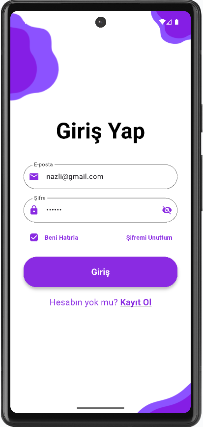
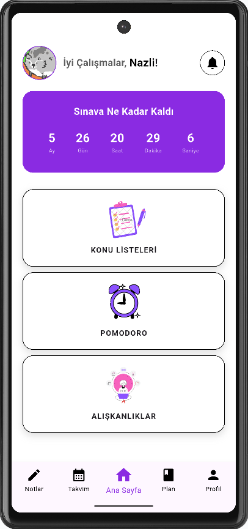
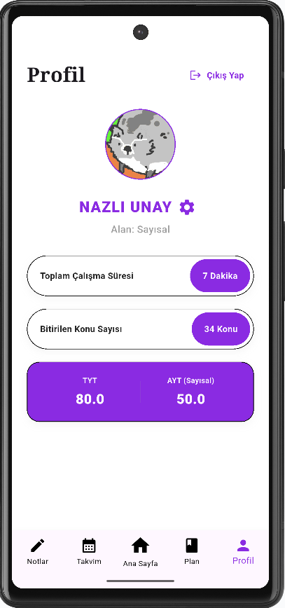
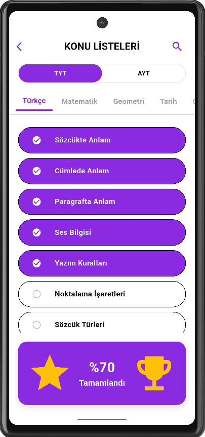
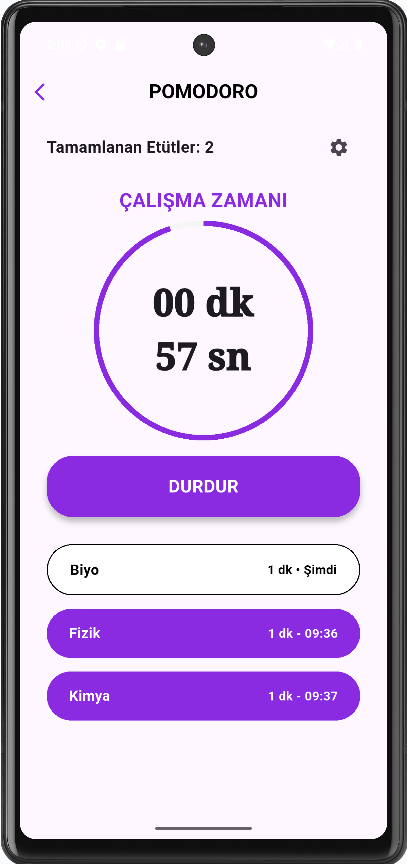
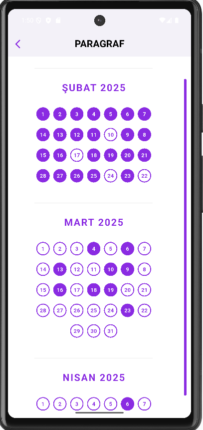
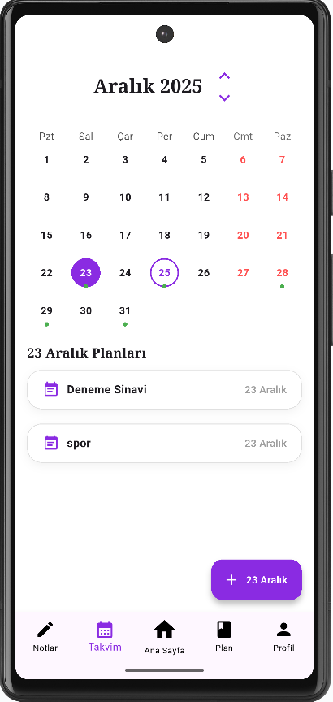
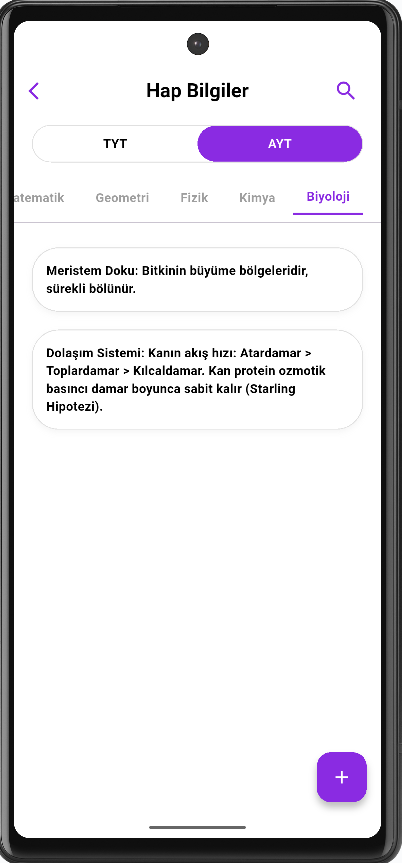

# YKS HOCAM - Mobil Sınav Asistanı

**YKS Hocam**, Yükseköğretim Kurumları Sınavı (YKS) sürecindeki öğrencilerin ders çalışma planlarını, konu ilerlemelerini ve notlarını dijital ortamda yönetebilmeleri için geliştirilmiş, **Flutter** tabanlı çok katmanlı bir mobil uygulamadır.

## Projenin Amacı
Kullanıcıların verimli bir şekilde çalışmasını, motivasyonunu korumasını ve tüm çalışma sürecini tek bir yerden takip etmesini sağlamaktır.

## Teknik Mimari
Uygulama, hem ölçeklenebilirlik hem de güvenilirlik açısından modern bir çok katmanlı mimari yapıya sahiptir:
* **Frontend:** Dart dili ve Flutter framework ile geliştirilmiş kullanıcı dostu arayüz.
* **Backend:** Flutter ve MSSQL veritabanı arasında veri alışverişini sağlayan **ASP.NET Web API**.
* **Veritabanı:** Tüm verilerin dinamik olarak saklandığı **MSSQL** veritabanı.

---

## 📸 Uygulama Ekran Görüntüleri

| Giriş & Kayıt | Anasayfa | Profil |
| :---: | :---: | :---: |
|  |  |  |

| Konular | Pomodoro Sayacı | Aliskanlik |
| :---: | :---: | :---: |
|  |  |  |

| Takvim | Not Ekle | Bildirimler |
| :---: | :---: | :---: |
|  |  |  |

---

##  Öne Çıkan Özellikler
* **Kullanıcı Yönetimi:** Kayıt olma, giriş yapma, şifre sıfırlama ve `shared_preferences` ile oturum yönetimi.
* **Pomodoro Sayacı:** `Timer` sınıfı kullanılarak oluşturulan, çalışma/mola sürelerinin ayarlanabildiği sayaç sistemi.
* **Konu Takibi:** TYT/AYT ders bazlı ilerleme durumu, MSSQL'den çekilen dinamik konu listeleri ve otomatik yüzde hesaplama.
* **Not Yönetimi:** "Hap Bilgiler", "TYT" ve "AYT" kategorilerinde dijital not tutma, düzenleme ve filtreleme.
* **Plan ve Alışkanlık Takibi:** Günlük/haftalık plan oluşturma ve "zincir sistemi" ile alışkanlık takibi.
* **Takvim Modülü:** `TableCalendar` paketi ile önemli günlerin ve deneme tarihlerinin planlanması.

---
**Geliştirici:** Şerife Nazlı Ünay 
